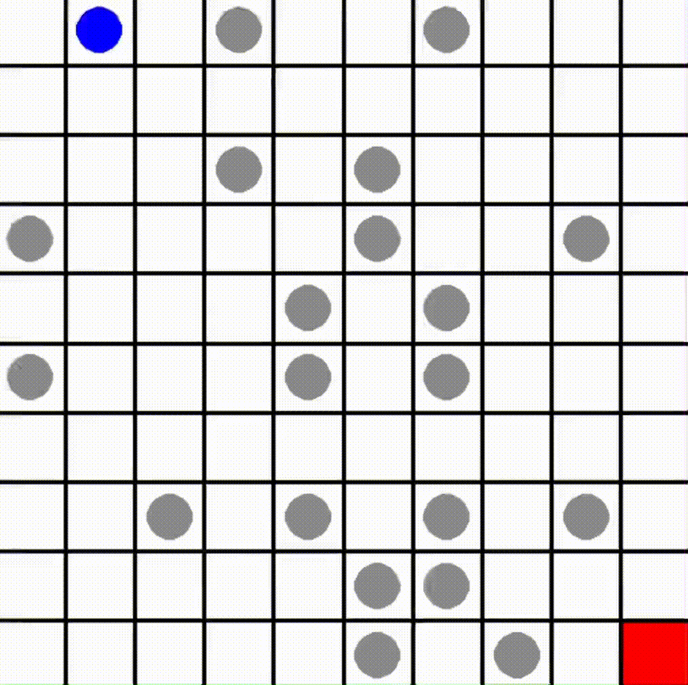
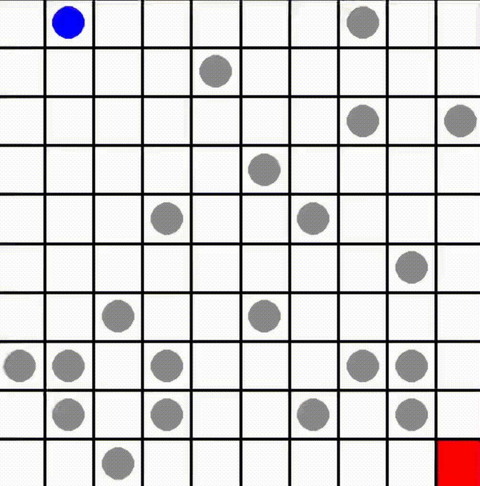

# Delivery-Controller
Navigate a grid map efficiently, avoiding obstacles, and find optimal paths for autonomous systems in this Pizza Delivery project. The repository combines Reinforcement Learning, Monte Carlo Tree Search, and Model-Based Formal Methods to create and validate effective path plans.

## Table of Contents

- [About](#about)
- [Installation](#installation)
- [Quick Start](#quick-start)
- [Training](#training)
- [Demonstration](#demonstration)

## About

The goal of this project is to develop intelligent path-planning techniques for autonomous systems delivering pizza. By combining Reinforcement Learning, Monte Carlo Tree Search, and Model-Based Formal Methods, we aim to create efficient and validated path plans that navigate through grid maps while avoiding obstacles.

## Installation
This repository employs a Conda environment to manage all dependencies efficiently. To install the custom environment, follow these steps:
1. Clone the repository:
```bash
git@github.com:Alexyskoutnev/Delivery-Controller.git
cd Delivery-Controller
```
2. Install Conda Enviroment
```bash
./install_env.sh
```
## Quick Start
2. Run Example PPO Policy
```bash
python3 scripts/eval.py
```
3. Run Example PPO + Safety Controller
```bash
python3 scripts/run.py
```
   
## Training

There two RL based training algorithms implemented for the simplex controller provided in this repo, DQN controller, and a PPO controller. To train either of the RL policy you can run the following commands,

### DQN Training
```bash
python3 scripts/train_dqn.py
```
### PPO Training
```bash
python3 scripts/train_ppo.py
```

# Demonstration

See the controller in action within a custom Gym environment. When safety properties are disabled, the trajectory of the agent is showcased without validation of liveness and safety throughout its path until it reaches the goal state.

## No Safety



## Safety

